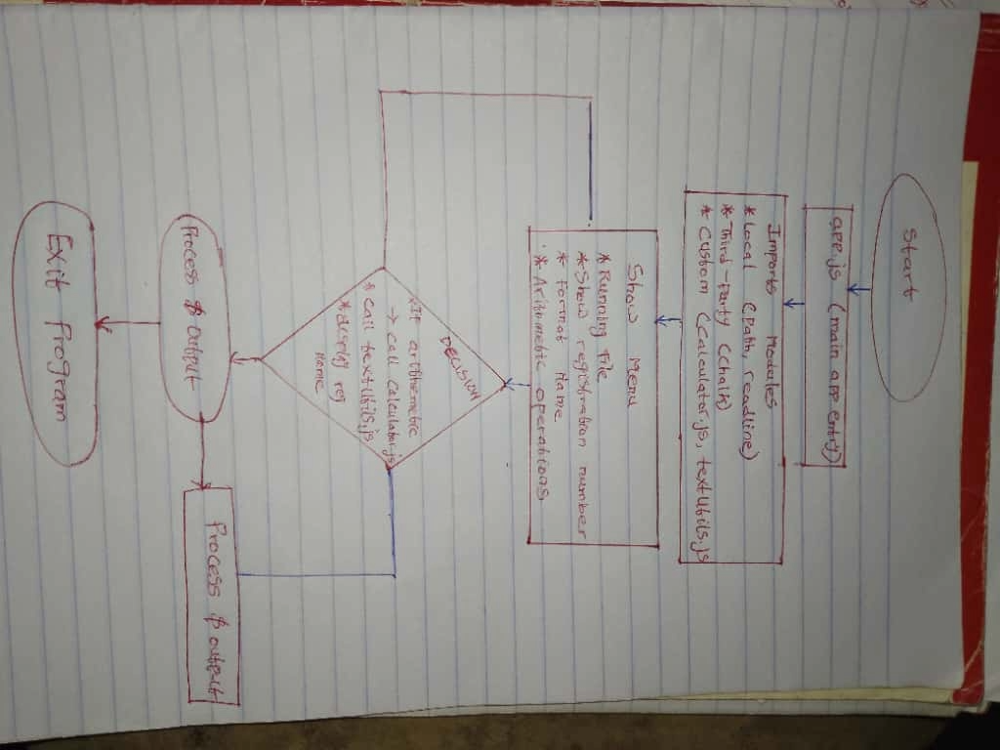

# Emmanuel Calculator App

This project demonstrates **Node.js module imports** using:

- ✅ Local (built-in) Node.js modules (`path`, `readline`)
- ✅ A third-party npm package (`chalk`)
- ✅ Two custom modules (`calculator.js` and `textUtils.js`)

---

## Features
- Perform basic arithmetic operations: add, subtract, multiply, divide.
- Format names into proper capitalization.
- Use `chalk` for colorful console output.
- Use `path` to get the current file basename.
- Use `readline` to take user input interactively.
- Logs my **registration number**: `BD/2025/TC3/048`.

---

## Project Structure

emmanuel-calculator/
│
├── my_module/
│ ├── calculator.js # Custom arithmetic module
│ └── textUtils.js # Custom text utility module
│
├── app.js # Main application
├── package.json # Project metadata + dependencies
└── flowchart.png # Project ideation sketch


---

## Flowchart (Ideation Sketch)

Below is the rough sketch showing how the application works:



---

## How to Run

1. Clone this repo:
   ```bash
   git clone https://github.com/your-username/emmanuel-calculator.git
   cd emmanuel-calculator

2. Install dependencies:

npm install


3. Run the application:

npm start


4. Follow the prompts in the terminal to use the calculator.

Author

Adeboye Emmanuel Oluwatosin

Registration Number: BD/2025/TC3/048